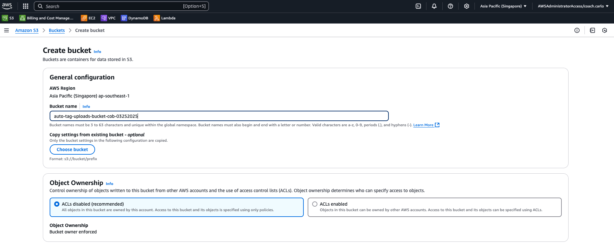
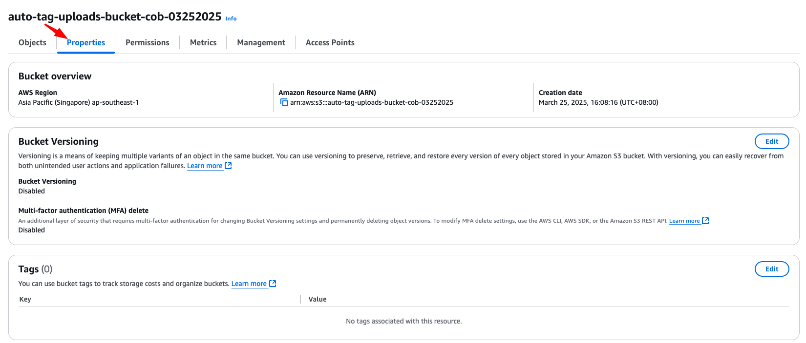

## Challenge: "Auto-Tag Your Uploads!"

### 🎯 Goal:
Whenever a user uploads a file to S3, an AWS Lambda function will:
✅ Automatically add metadata tags based on the file type
✅ Log details of the uploaded file

## Step 1: Setup the S3 Bucket
1. Create an S3 bucket (e.g., auto-tag-uploads-bucket).


2. Go to Properties → Event notifications → Create event



3. Event name: upload-tagging-trigger

4. Event type: PUT (Trigger when a new file is uploaded)

5. Destination: Select AWS Lambda

## Step 2: Create the Lambda Function
1. Go to AWS Lambda → Click "Create function"

2. Choose "Author from scratch"

3. Function name: auto-tag-s3-uploads

4. Runtime: Python 3.x

5. Click "Create function"

## Step 3: Add the Lambda Code
1. Replace the default code with this:

```python
import json
import boto3

# Initialize S3 client
s3 = boto3.client("s3")

# Define tags based on file types
TAGS_MAPPING = {
    "jpg": [{"Key": "FileType", "Value": "Image"}, {"Key": "Category", "Value": "Media"}],
    "png": [{"Key": "FileType", "Value": "Image"}, {"Key": "Category", "Value": "Media"}],
    "mp4": [{"Key": "FileType", "Value": "Video"}, {"Key": "Category", "Value": "Media"}],
    "pdf": [{"Key": "FileType", "Value": "Document"}, {"Key": "Category", "Value": "Docs"}],
    "docx": [{"Key": "FileType", "Value": "Document"}, {"Key": "Category", "Value": "Docs"}],
}

def lambda_handler(event, context):
    # Extract file info from S3 event
    record = event["Records"][0]
    bucket_name = record["s3"]["bucket"]["name"]
    object_key = record["s3"]["object"]["key"]
    
    # Extract file extension
    file_extension = object_key.split(".")[-1].lower()
    
    # Check if we have predefined tags for this file type
    tags = TAGS_MAPPING.get(file_extension, [{"Key": "FileType", "Value": "Unknown"}])

    try:
        # Apply tags to the uploaded object
        s3.put_object_tagging(
            Bucket=bucket_name,
            Key=object_key,
            Tagging={"TagSet": tags}
        )

        print(f"✅ Tagged {object_key} with {tags}")

        return {
            "statusCode": 200,
            "body": json.dumps({"message": "Tags applied successfully!", "file": object_key, "tags": tags})
        }
    
    except Exception as e:
        print(f"❌ Error tagging file {object_key}: {str(e)}")
        return {
            "statusCode": 500,
            "body": json.dumps({"error": str(e)})
        }
```


## Step 4: Grant S3 Permissions
Lambda needs permission to read & tag objects in S3.
1. Go to IAM → Roles → Find your Lambda's IAM role

2. Attach the S3 Full Access policy (or custom policy for tagging)

## Step 5: Test the Lambda Function
1. Upload a .jpg, .pdf, or .docx file to S3
2. The Lambda function automatically tags it
3. Go to S3 → Select the file → Properties → Tags ✅
